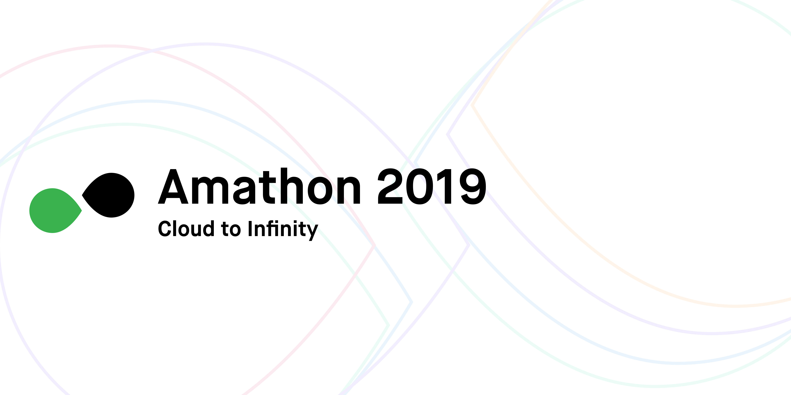

# amathon-seminar-list

## 2019 Amathon 사전세션 자료 Repo입니다. 🥳🥳🥳

### 해당 자료는 2019/08/29(목)에 진행되며 모두 AUSG 멤버들에 의해서 진행됩니다.

- AUSG 2기 [고명진](https://github.com/rayleighko): [Amplify로 풀사이클 개발 체험하기](https://github.com/rayleighko/amathon-amplify-FCD)

- AUSG 2기 [고윤호](https://github.com/yoonhoGo): [클라우드 컨테이너 환경에서 Back-end API 구성하기 AtoZ](https://github.com/yoonhoGo/2019-amathon-session/blob/master/README.md)

- AUSG 1기 [원지혁](https://github.com/tonyfromundefined): Serverless Framework로 React배포하기

- AUSG 1기 [윤서현](https://github.com/seohyun0120): [CircleCI + ElasticBeanstalk을 활용한 React 배포 자동화]( https://github.com/seohyun0120/amathon-eb-circleci/blob/master/README.md/)
